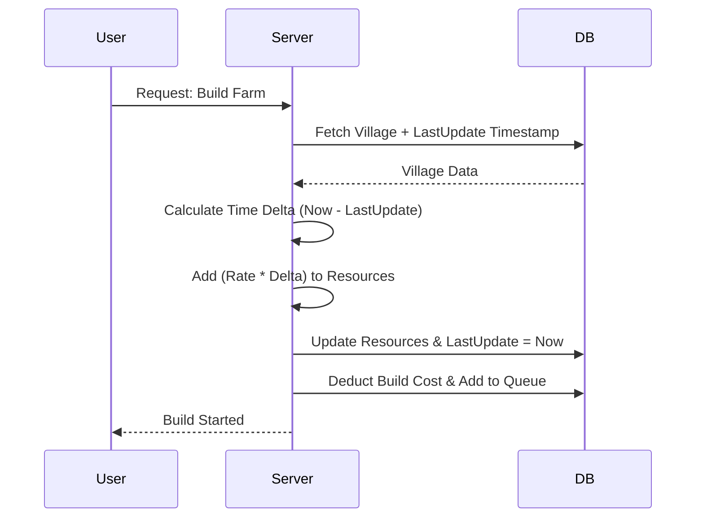

# Steppe Khanate: Server-Authoritative Backend Engine

> **Tech Demo**: A high-performance, cheat-proof backend core for a historical MMORTS (Massively Multiplayer Online Real-Time Strategy) game.

---

## 👨‍💻 Executive Summary

This project is a **Proof of Concept (PoC)** demonstrating advanced backend system design capabilities. It specifically addresses the complex challenges of state management, concurrency, and cheating in persistent online games.

**Key Technical Competencies Demonstrated:**

- **System Design**: Implementing a "Server-Authoritative" architecture where the server is the single source of truth.
- **Scalability**: Using "Lazy Evaluation" algorithms to handle thousands of concurrent players without O(N) loop overhead.
- **Concurrency Control**: Leveraging database transactions (ACID capabilities) to prevent race conditions and duping exploits.
- **TypeScript & NestJS**: Writing type-safe, modular, and enterprise-grade Node.js code.

---

## 🏗️ Architecture & Design Patterns

### 1. The "Server-Authoritative" Model

In many basic apps, the client tells the server what happened. In this engine, **trust is zero**.

- **Client**: Sends _intents_ (e.g., "Request to build Farm").
- **Server**: Validates feasibility (Cost, Requirements), Deducts resources, and Schedules the event.
- **Result**: Impossible to hack resources or speed up time via client-side manipulation.

### 2. Scalable "Lazy Ticking" (O(1) vs O(N))

A native approach would be to loop through 10,000 active users every second to update their wood/clay/iron counts. This is computationally expensive (O(N)).

**My Solution**:
Resources are calculated mathematically _only when needed_ (e.g., when a user requests a build or views their village).



### 3. Atomic Transactions & Race Conditions

To prevent "Double Spending" (clicking build twice instantly to get two buildings for the price of one), all critical operations run inside strict **Prisma Transactions**. This ensures that reading resources, deducting cost, and queuing the job happen as an indivisible unit of work.

---

## 🛠️ Tech Stack

| Component     | Technology       | Reasoning                                                                          |
| :------------ | :--------------- | :--------------------------------------------------------------------------------- |
| **Framework** | **NestJS**       | Modular architecture, Dependency Injection, and heavy industry adoption.           |
| **Language**  | **TypeScript**   | Full type safety for reliable, maintainable codebase.                              |
| **Database**  | **SQLite (Dev)** | lightweight relational store via **Prisma ORM**. (Easily swappable to PostgreSQL). |
| **Job Queue** | **In-Memory**    | Simulating async job processing (Replacable with Redis/BullMQ for production).     |

---

## 🚀 Running the Demo

This repository includes a simulation script that acts as a client, proving the system works as intended.

### Prerequisites

- Node.js (v18+)

### 1. Installation & Setup

```bash
cd server
npm install
npx prisma generate
npx prisma migrate dev --name init
```

### 2. Start the Server

```bash
npm run start
```

_Server listens on `http://localhost:3000`_

### 3. Run the Simulation

Open a new terminal to run the automated scenario:

```bash
npx ts-node demo_script.ts
```

**Simulation Output:**

1.  **World Gen**: Creates a new village (User + Data).
2.  **Ticking**: Waits 3s, verifies resources increased exactly according to production rate.
3.  **Action**: Attempts to build a "Farm". Resources are atomically deducted.
4.  **Completion**: Server validates time completion and upgrades the building.

---

## 🔮 Future Roadmap (Production Readiness)

To take this from PoC to a live MMO with 50k+ users, the next steps are:

- [ ] **PostgreSQL**: Migrate from SQLite for concurrent connection handling.
- [ ] **Redis**: Implement BullMQ for distributed job queues (moving timers off-memory).
- [ ] **WebSockets**: Replace polling with Socket.io for real-time "Attack Incoming" alerts.
