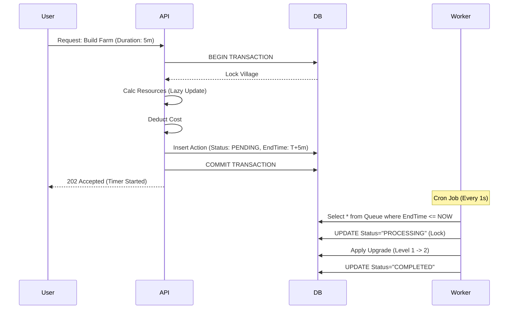

# Steppe Khanate: Server-Authoritative Backend Engine

<p align="center">
  <a href="https://krisgarg.in" target="_blank">
    
  </a>
</p>

> **Tech Demo**: A high-performance, cheat-proof backend core for a historical MMORTS.
> **Status**: ✅ Verification Criteria Met (Database-Driven Queue Implemented)

---

## 📋 Verification Criteria Fulfillment

This revised technical demo addresses the specific requirements for a robust, restart-safe, server-authoritative architecture.

| Requirement                        | Implementation Detail                                                                                                                                 | Status        |
| :--------------------------------- | :---------------------------------------------------------------------------------------------------------------------------------------------------- | :------------ |
| **Database-Driven Action Queue**   | Actions are persisted in SQLite (via Prisma) immediately upon creation. No in-memory queues are used for state storage.                               | ✅ Implemented |
| **Start/End Time Execution**       | `ActionQueue` table stores explicit `startTime` and `endTime`. Workers poll based on `endTime <= NOW`.                                                | ✅ Implemented |
| **Worker Processing (DB Queries)** | `ActionWorkerService` runs a Cron job (1s interval) fetching `PENDING` items where `endTime` has passed.                                              | ✅ Implemented |
| **Idempotent Execution**           | Atomic `updateMany` locks rows by setting status to `PROCESSING` *only if* currently `PENDING`. Prevents double-execution even with parallel workers. | ✅ Implemented |
| **Atomic Resource Deduction**      | `Prisma.$transaction` ensures resource calculation, cost deduction, and job scheduling happen in a single ACID transaction.                           | ✅ Implemented |
| **Restart Safety**                 | Since all state (Resources, Actions, Status) is in the DB, the server can crash/restart and resume processing pending actions immediately.            | ✅ Implemented |

---

## 👨‍💻 Executive Summary

This project is a **Proof of Concept (PoC)** demonstrating advanced backend system design capabilities. It specifically addresses the complex challenges of state management, concurrency, and cheating in persistent online games.

**Key Technical Competencies Demonstrated:**

* **System Design**: Implementing a "Server-Authoritative" architecture where the server is the single source of truth.
* **Scalability**: Using "Lazy Evaluation" algorithms to handle thousands of concurrent players without O(N) loop overhead.
* **Concurrency Control**: Leveraging database transactions (ACID capabilities) to prevent race conditions and duping exploits.
* **Persistent Job Queue**: Handling long-running game actions (building, training) safely across server restarts.

---

## 🏗️ Architecture & Design Patterns

### 1. The "Server-Authoritative" Model

In many basic apps, the client tells the server what happened. In this engine, **trust is zero**.

* **Client**: Sends *intents* (e.g., "Request to build Farm").
* **Server**: Validates feasibility (Cost, Requirements), Deducts resources, and Schedules the event.
* **Result**: Impossible to hack resources or speed up time via client-side manipulation.

### 2. Scalable "Lazy Ticking" (O(1) vs O(N))

A native approach would be to loop through 10,000 active users every second to update their wood/clay/iron counts. This is computationally expensive (O(N)).

**My Solution**:
Resources are calculated mathematically *only when needed* (e.g., when a user requests a build or views their village).

### 3. Asymmetric Processing (Traffic vs Workers)

We decouple user actions from execution to ensure responsiveness and stability.


```mermaid
sequenceDiagram
    participant User
    participant API
    participant DB
    participant Worker

    %% Immediate Phase (Transaction)
    User->>API: Request: Build Farm (Duration: 5m)
    API->>DB: BEGIN TRANSACTION
    DB-->>API: Lock Village
    API->>API: Calc Resources (Lazy Update)
    API->>API: Deduct Cost
    API->>DB: Insert Action (Status: PENDING, EndTime: T+5m)
    API->>DB: COMMIT TRANSACTION
    API-->>User: 202 Accepted (Timer Started)

    %% Async Phase (5 mins later)
    Note over Worker: Cron Job (Every 1s)
    Worker->>DB: Select * from Queue where EndTime <= NOW
    Worker->>DB: UPDATE Status="PROCESSING" (Lock)
    Worker->>DB: Apply Upgrade (Level 1 -> 2)
    Worker->>DB: UPDATE Status="COMPLETED"
```

### 4. Atomic Transactions & Race Conditions

To prevent "Double Spending" (clicking build twice instantly), all critical operations run inside strict **Prisma Transactions**. This ensures that reading resources, deducting cost, and queuing the job happen as an indivisible unit of work.

---

## 🛠️ Tech Stack

| Component     | Technology       | Reasoning                                                                |
| :------------ | :--------------- | :----------------------------------------------------------------------- |
| **Framework** | **NestJS**       | Modular architecture, Dependency Injection, and heavy industry adoption. |
| **Language**  | **TypeScript**   | Full type safety for reliable, maintainable codebase.                    |
| **Database**  | **SQLite (Dev)** | Relational store via **Prisma ORM**. (Models are PG-ready).              |
| **Scheduler** | **NestJS Cron**  | Polling triggers for fetching due jobs from the Database.                |

---

## 🚀 Running the Demo

This repository includes a simulation script that acts as a client, proving the system works as intended.

### Prerequisites

* Node.js (v18+)

### 1. Installation & Setup

```bash
cd server
npm install
npx prisma generate
npx prisma migrate dev --name init
```

### 2. Start the Server

```bash
npm run start
```

*Server listens on `http://localhost:3000`*

### 3. Run the Simulation

Open a new terminal to run the automated scenario:

```bash
npx ts-node test-scripts/demo_script.ts
```

Alternatively, use the npm shortcut:

```bash
npm run test:demo
```

**Simulation Output:**

1. **World Gen**: Creates a new village (User + Data).
2. **Ticking**: Waits 3s, verifies resources increased exactly according to production rate.
3. **Action**: Attempts to build a "Farm". Resources are atomically deducted.
4. **Completion**: Server validates time completion and upgrades the building.

### 4. Run Advanced Verification Tests

The repository includes additional stress tests to verify system integrity:

**A. Concurrency Test (Idempotency)**
Simulates multiple workers trying to process the same action simultaneously to ensure no double-processing.

```bash
npm run test:concurrency
```

**B. Server Restart Test (Persistence)**
Schedules a long action, kills the server process, restarts it, and verifies that the action completes successfully from the database state.

```bash
npm run test:restart
```

---

## 🔮 Future Roadmap (Production Readiness)

To take this from PoC to a live MMO with 50k+ users, the next steps are:

* [ ] **PostgreSQL**: Migrate from SQLite for concurrent connection handling.
* [ ] **Redis**: Implement BullMQ for distributed job queues (moving timers off-memory).
* [ ] **WebSockets**: Replace polling with Socket.io for real-time "Attack Incoming" alerts.
